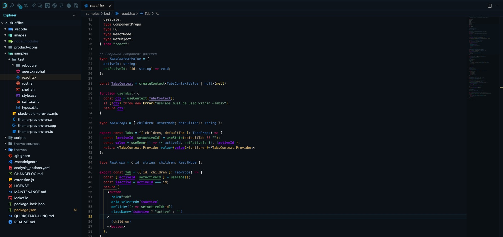
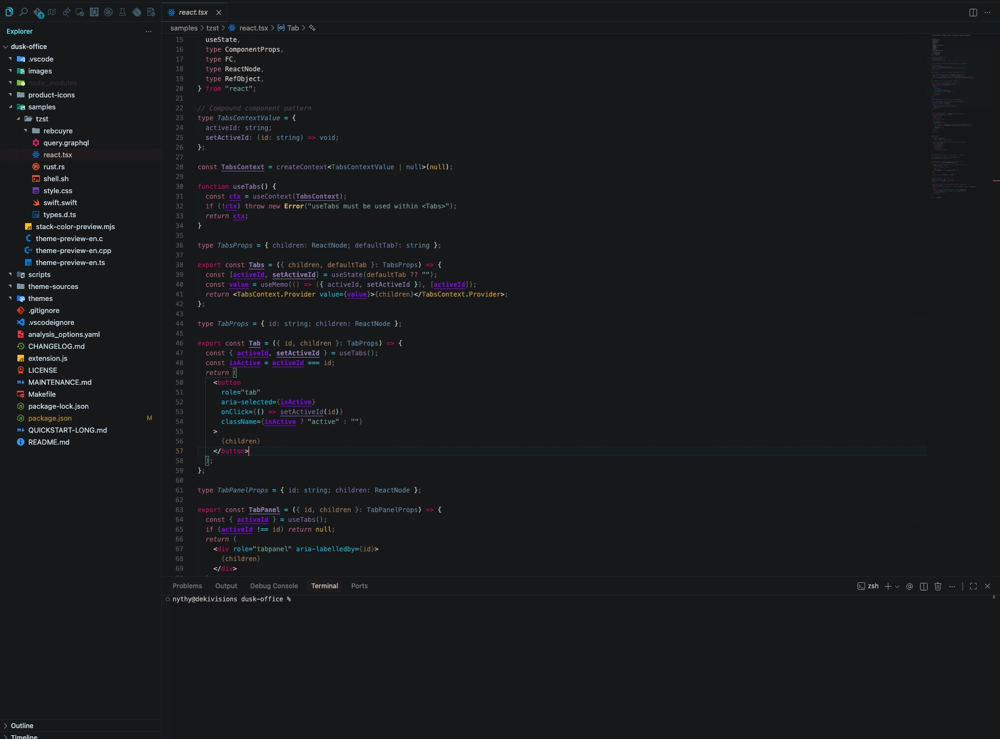
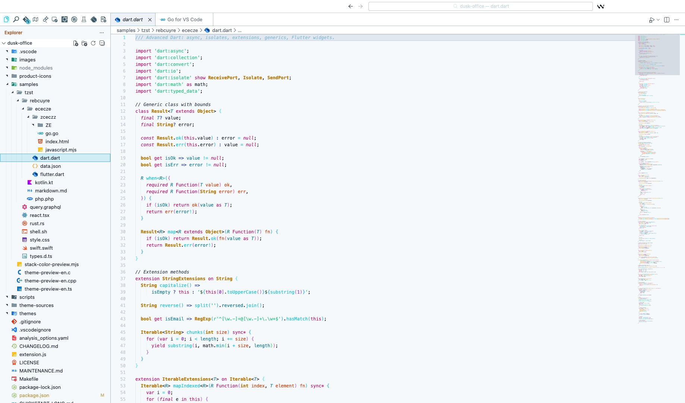
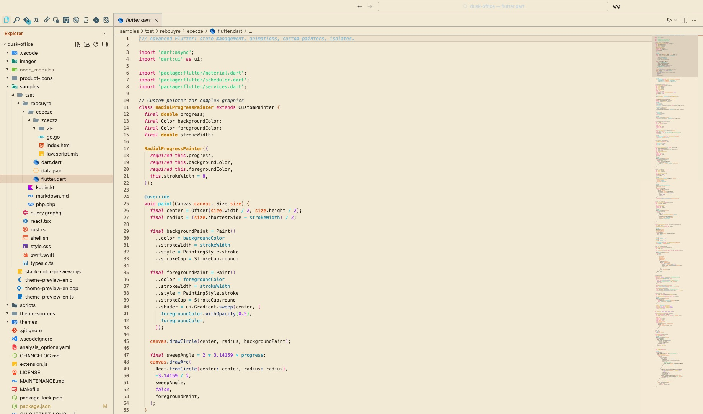
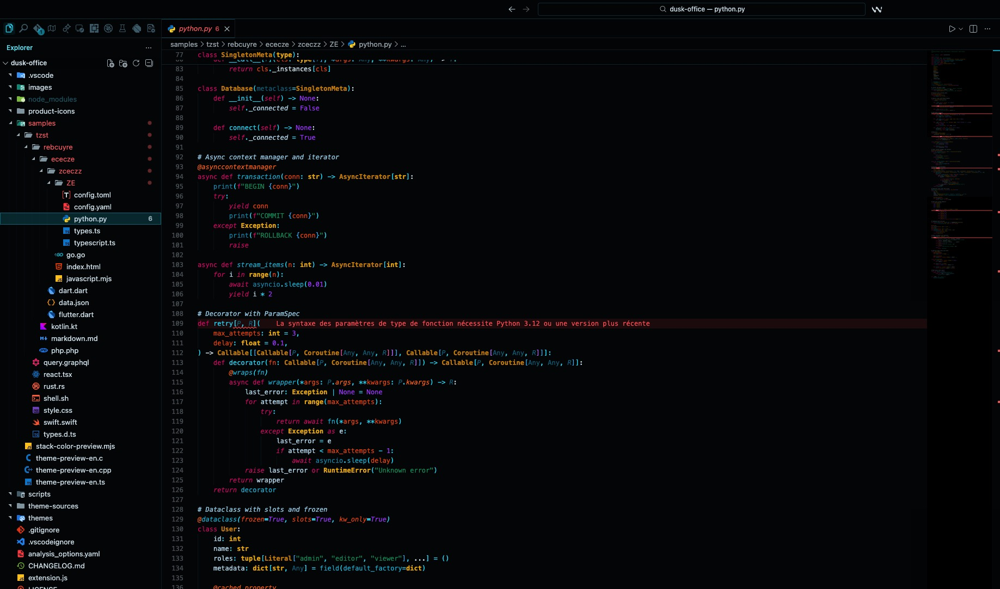

# Dusk Office

**Dusk Office** is a **VS Code**, **Cursor**, and **Windsurf** theme pack with **16 dark, light, and high-contrast themes**, **semantic highlighting**, **full UI theming**, and an optional **product icon theme**.

Built for developers who want readable code, polished chrome, OLED-friendly dark modes, light daytime variants, and consistent contrast across the editor, terminal, and workbench.

This **README** is the primary documentation (GitHub and Marketplace). **Public documentation mirror:** [github.com/SIDIKICONDE/dusk-office-docs](https://github.com/SIDIKICONDE/dusk-office-docs). Extended guide — full theme list, terminal palettes, contrast notes — [QUICKSTART-LONG.md](./QUICKSTART-LONG.md) · [same file on the docs repo](https://github.com/SIDIKICONDE/dusk-office-docs/blob/main/QUICKSTART-LONG.md).

**Marketplace:** [dekidev.dusk-office](https://marketplace.visualstudio.com/items?itemName=dekidev.dusk-office)

---

## Screenshots

| Dusk Office Midnight | Dusk Office Abyss | Dusk Office Nocturne |
|:---:|:---:|:---:|
|  |  |  |

| Dusk Office Finance | Dusk Office Ivory |
|:---:|:---:|
|  |  |

---

## Install

**From Marketplace:**
1. Extensions panel → Search `Dusk Office` → **Install**
2. Bundled: Material Icon Theme + Markdown All in One (uninstall if unwanted)

**From VSIX:**
```bash
# Download from GitHub releases, then:
code --install-extension dusk-office-*.vsix
```

---

## Switch Theme

**Command Palette:**
1. `Cmd/Ctrl + Shift + P` → `Preferences: Color Theme`
2. Pick any `Dusk Office` variant

**Control Center (recommended):**
- `Cmd/Ctrl + Shift + P` → `Dusk Office: Control Center`
- Or click the status bar entry (enable with `duskOffice.statusBar.enabled`)
- Quick actions: switch theme, previous, favorite, auto switch, product icons, activity bar position, title bar align, status bar button, workspace theme memory, settings

---

## Pick a Variant

| If you want... | Use |
|---|---|
| Very dark, OLED-friendly | **Dusk Office Midnight** |
| Vivid blue-cyan contrast | **Dusk Office Abyss** |
| Warm vintage terminal | **Dusk Office Nocturne** |
| Premium banking aesthetic | **Dusk Office Finance** |
| Light / daytime | **Dusk Office Ivory** |
| High contrast / accessibility | **Dusk Office High Contrast** |

Full list of 16 variants: [Included Themes](./QUICKSTART-LONG.md#included-themes) · [on GitHub](https://github.com/SIDIKICONDE/dusk-office-docs/blob/main/QUICKSTART-LONG.md#included-themes).

---

## Quick Settings

Open settings (`Cmd/Ctrl + ,`) and search `Dusk Office`:

- `duskOffice.applyFavoriteOnStartup` — auto-load favorite theme
- `duskOffice.rememberWorkspaceTheme` — per-workspace memory
- `duskOffice.autoSwitch.enabled` — auto day/night switch

---

## Next Steps

- Deep customization: [Settings](./QUICKSTART-LONG.md#settings) · [mirror](https://github.com/SIDIKICONDE/dusk-office-docs/blob/main/QUICKSTART-LONG.md#settings)
- Changelog: [CHANGELOG.md](./CHANGELOG.md) · [mirror](https://github.com/SIDIKICONDE/dusk-office-docs/blob/main/CHANGELOG.md)
- **Color harmony & eye comfort** — how variants stay coherent and easy on the eyes (chrome vs editor, terminal blend, contrast checks): [MAINTENANCE.md](./MAINTENANCE.md) (section *Color harmony & eye comfort*)
- Terminal contrast verification: in a clone of [SIDIKICONDE/dusk-office](https://github.com/SIDIKICONDE/dusk-office), run `npm run verify:terminal`

---

## Also by the same developer

**🛠️ [NythyCleaner](https://nythycleaner.cloud)** — Native macOS utility for developers. Xcode cleanup, disk scanner, AI duplicate detection, real-time monitoring.

*Sponsored by our own Mac utility — [NythyCleaner](https://nythycleaner.cloud)*
