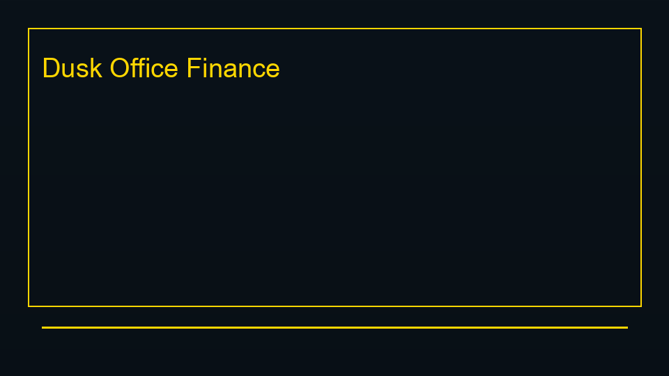
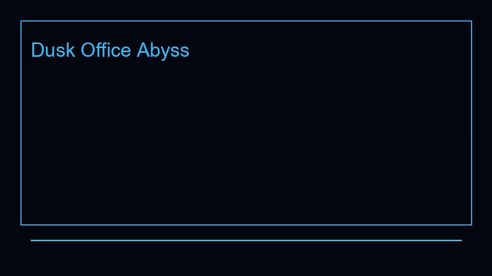
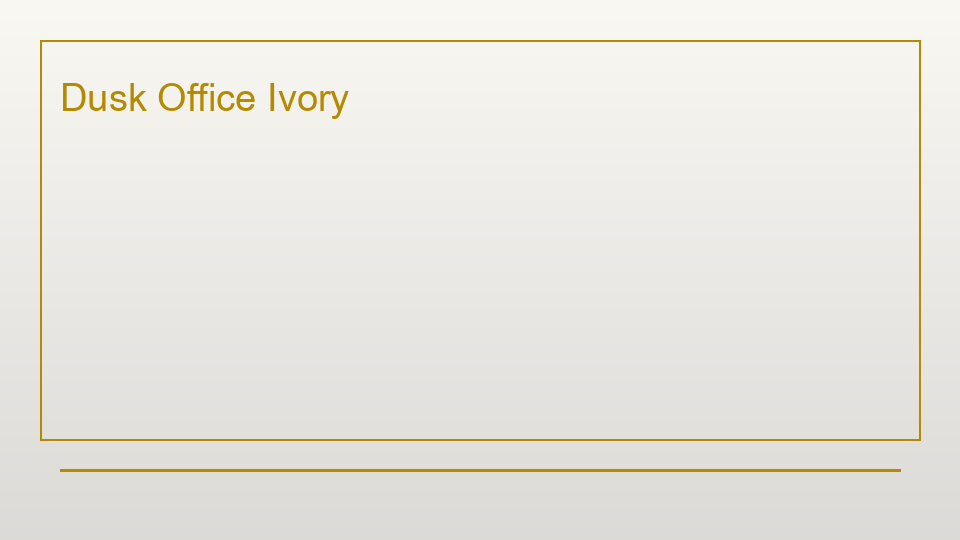
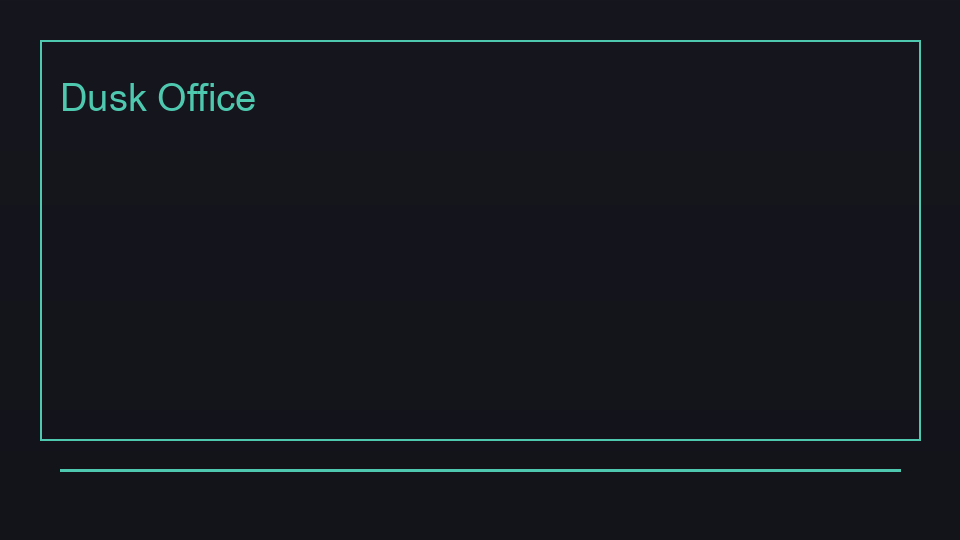
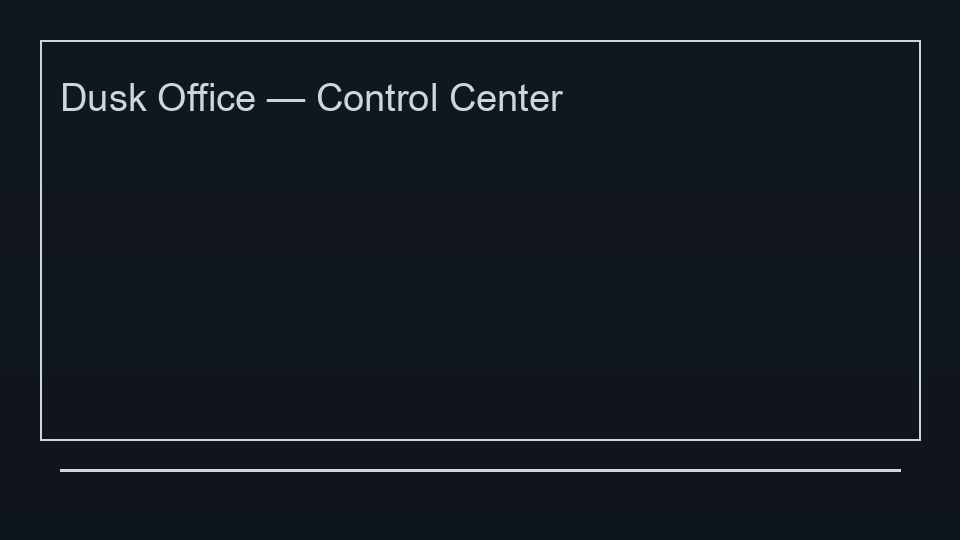
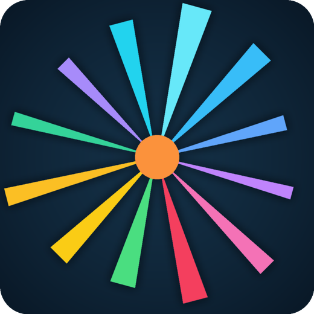

# Dusk Office

Dark themes for **VS Code** and **Cursor**. 15+ variants, semantic highlighting, full UI theming.

**Public documentation** for Dusk Office ([this repository](https://github.com/SIDIKICONDE/dusk-office-docs)). **Extension source:** [SIDIKICONDE/dusk-office](https://github.com/SIDIKICONDE/dusk-office). The same readme ships on the **Marketplace** with the extension. Extended guide — [QUICKSTART-LONG.md](./QUICKSTART-LONG.md).

**Marketplace:** [dekidev.dusk-office](https://marketplace.visualstudio.com/items?itemName=dekidev.dusk-office)

## Screenshots

<p align="center">

</p>

<p align="center">

&nbsp;&nbsp;

&nbsp;&nbsp;

</p>

<p align="center">

</p>

<p align="center"></p>

---

## Install

**From Marketplace:**
1. Extensions panel → Search `Dusk Office` → **Install**
2. Bundled: Material Icon Theme + Markdown All in One (uninstall if unwanted)

**From VSIX:**
```bash
# Download from GitHub releases, then:
code --install-extension dusk-office-*.vsix
```

---

## Switch Theme

**Command Palette:**
1. `Cmd/Ctrl + Shift + P` → `Preferences: Color Theme`
2. Pick any `Dusk Office` variant

**Control Center (recommended):**
- `Cmd/Ctrl + Shift + P` → `Dusk Office: Control Center`
- Or click the status bar entry (enable with `duskOffice.statusBar.enabled`)

---

## Pick a Variant

| If you want... | Use |
|---|---|
| Very dark, OLED-friendly | **Dusk Office Midnight** |
| Vivid blue-cyan contrast | **Dusk Office Abyss** |
| Warm vintage terminal | **Dusk Office Nocturne** |
| Premium banking aesthetic | **Dusk Office Finance** |
| Light / daytime | **Dusk Office Ivory** |
| High contrast / accessibility | **Dusk Office High Contrast** |

Full list of 15+ variants: [Included Themes](./QUICKSTART-LONG.md#included-themes) · [on GitHub](https://github.com/SIDIKICONDE/dusk-office-docs/blob/main/QUICKSTART-LONG.md#included-themes).

---

## Quick Settings

Open settings (`Cmd/Ctrl + ,`) and search `Dusk Office`:

- `duskOffice.applyFavoriteOnStartup` — auto-load favorite theme
- `duskOffice.rememberWorkspaceTheme` — per-workspace memory
- `duskOffice.autoSwitch.enabled` — auto day/night switch

---

## Next Steps

- Deep customization: [Settings](./QUICKSTART-LONG.md#settings)
- Terminal contrast verification: clone [SIDIKICONDE/dusk-office](https://github.com/SIDIKICONDE/dusk-office) and run `npm run verify:terminal`
- Contributing / building themes: [MAINTENANCE.md](./MAINTENANCE.md)

---

## Also by the same developer

**🛠️ [NythyCleaner](https://nythycleaner.cloud)** — Native macOS utility for developers. Xcode cleanup, disk scanner, AI duplicate detection, real-time monitoring.

*Sponsored by our own Mac utility — [NythyCleaner](https://nythycleaner.cloud)*